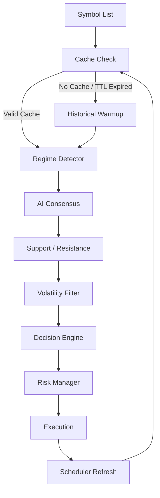

# Final Trading Pipeline

## Akış Sırası
1. Symbol list alınır.
2. Cache kontrol edilir.
3. Cache yoksa veya TTL dolduysa historical warmup çalışır.
4. Market regime detection yapılır.
5. AI consensus skoru üretilir.
6. Support/resistance bias hesaplanır.
7. Volatility filter uygulanır.
8. Final decision engine LONG/SHORT/WAIT üretir.
9. Risk manager position size belirler.
10. Execution katmanı emir gönderir.
11. APScheduler warmup ve retrain görevlerini periyodik çalıştırır.

## Karar Mantığı
- Rejim ana ağırlıktır.
- AI doğrulayıcıdır.
- Support/resistance giriş ve hedef seviyeleri için kullanılır.
- Volatilite risk düzeltmesi yapar.
- Confidence decay eski sinyalleri zayıflatır.

## Önerilen Ağırlıklar
- Regime: %45
- AI: %20
- Support/Resistance: %20
- Volatility: %15

## Çalışma Kuralı
- Cache geçerli değilse historical data ile yeniden öğren.
- Rejim zayıfsa işlem açma.
- AI ve S/R aynı yöndeyse confidence artır.
- Volatilite yüksekse pozisyon boyutunu küçült.
- TTL dolunca otomatik retrain yap.

## Akış Diyagramı

